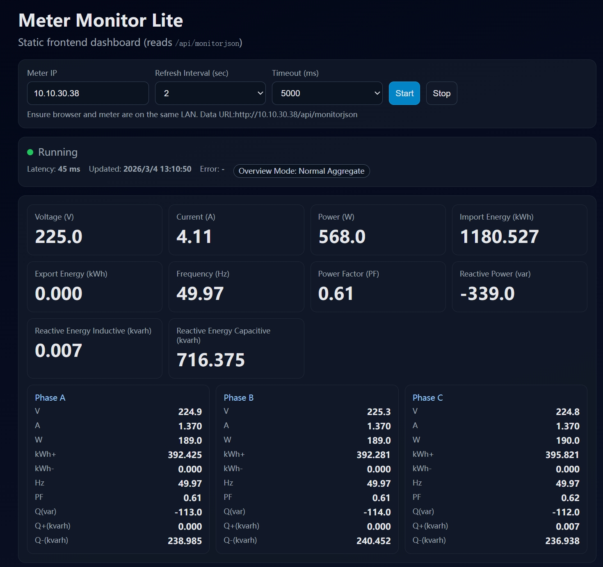

# Local Monitor Lite

A lightweight **static** dashboard for IAMMETER local devices.

It reads meter data directly from:

`http://<meter-ip>/api/monitorjson`

No backend service is required.

---

## Screenshot



---

## Table of Contents

- [Screenshot](#screenshot)
- [Features](#features)
- [How to Use](#how-to-use)
  - [Step 1 – Configure Connection](#step-1--configure-connection)
  - [Step 2 – Start Monitoring](#step-2--start-monitoring)
- [Data Compatibility](#data-compatibility)
  - [Single-Phase Payload](#single-phase-payload)
  - [Three-Phase Payload](#three-phase-payload)
  - [Net Metering Priority](#net-metering-priority)
- [How to Run](#how-to-run)
  - [Option A – Open Directly](#option-a--open-directly)
  - [Option B – Host with a Web Server](#option-b--host-with-a-web-server)
- [Project Structure](#project-structure)
- [Troubleshooting](#troubleshooting)
- [References](#references)

---

## Features

- Configurable **Meter IP**
- Configurable **refresh interval** and **request timeout**
- Live status indicator (**Running / Error / Stopped**)
- Overview cards for key metrics:
  - Voltage, Current, Power
  - Import/Export Energy
  - Frequency, Power Factor
  - Reactive Power, Reactive Energy (Inductive/Capacitive)
- Supports both:
  - single-phase `Data`
  - three-phase `Datas` (A/B/C)
- Three-phase panel with per-phase metrics:
  - V / A / W / kWh+ / kWh- / Hz / PF / Q / Q+ / Q-
- **Net Metering mode detection**:
  - if `Datas[3]` exists, overview uses this row as priority
  - overview badge switches to `Overview Mode: Net Metering`
- Raw JSON viewer for debugging
- Local settings persistence via `localStorage`

---

## How to Use

### Step 1 – Configure Connection

1. Open the page.
2. Enter **Meter IP** (example: `192.168.1.100`).
3. Select refresh interval and timeout.

### Step 2 – Start Monitoring

1. Click **Start**.
2. Confirm status becomes **Running**.
3. Check the overview mode badge:
   - `Overview Mode: Normal Aggregate`
   - or `Overview Mode: Net Metering`

---

## Data Compatibility

### Single-Phase Payload

Uses `Data` array:

`[Voltage, Current, Power, ImportEnergy, ExportEnergy, Frequency, PF]`

Reactive values are read from `EA.Reactive[0]` when available.

### Three-Phase Payload

Uses `Datas[0..2]` for **Phase A/B/C**.

Overview defaults to aggregate:

- Voltage/Frequency/PF: average of A/B/C
- Current/Power/Import/Export: sum of A/B/C

Reactive overview defaults to sum of `EA.Reactive[0..2]`.

### Net Metering Priority

If an additional 4th row exists:

- `Datas[3]` → overview values use this row first
- `EA.Reactive[3]` (if present) → overview reactive values use this row first

Badge displays `Overview Mode: Net Metering`.

---

## How to Run

### Option A – Open Directly

Open:

`frontend/index.html`

No installation or server setup required.

### Option B – Host with a Web Server

You can host it via Nginx/Apache/GitHub Pages/NAS, or run locally:

```bash
python -m http.server
```

Then open:

`http://localhost:8000/apps/local-monitor-lite/frontend/index.html`

---

## Project Structure

```text
apps/local-monitor-lite/
  manifest.json
  README.md
  frontend/
    index.html
  screenshot.jpg (optional)
```

---

## Troubleshooting

- **No data / timeout**
  - verify meter IP is correct
  - ensure browser and meter are in the same LAN
  - check network/firewall routing
- **HTTP error**
  - verify `/api/monitorjson` is accessible from browser
- **Unexpected values**
  - open Raw JSON panel and verify payload structure (`Data` vs `Datas`)

---

## References

- IAMMETER App Store: https://www.iammeter.com/app-store
- IAMMETER AppStore repo: https://github.com/IAMMETER/appstore/tree/main
- Example static README (reference style): https://github.com/IAMMETER/appstore/blob/main/apps/example-static/README.md
